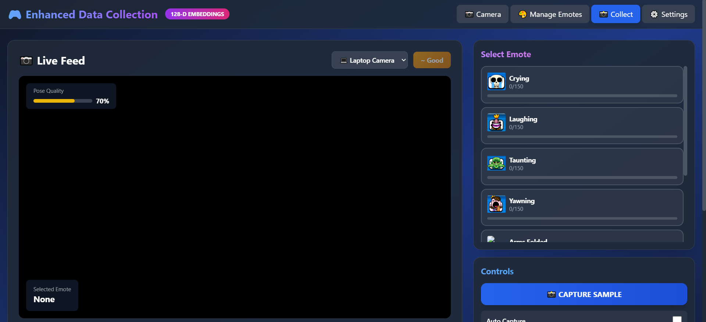
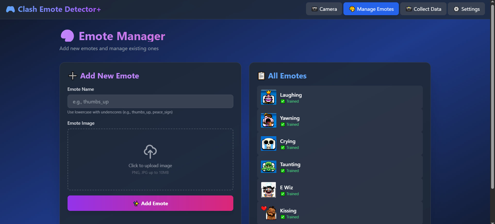
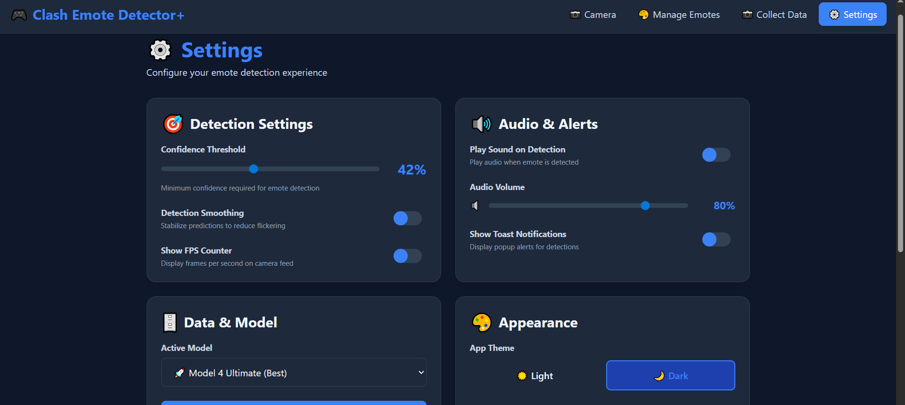

# 🎮 Clash Royale Emote Detector v2.2

## Part 1: The Hook (For HR/Managers)

**What is it?**
A real-time AI application that lets you trigger Clash Royale emotes using body gestures.

**The Problem**
Streamers and gamers struggle to keep their audience engaged while playing; manually triggering sound effects or overlays breaks their flow and focus.

**The Solution**
This app uses your webcam to "watch" your movements. When you strike a pose (like a laugh or a cry), it instantly plays the matching Clash Royale emote and sound. It's hands-free, instant, and fun.

**Example**
"Instead of 'A computer vision project,' say 'An interactive engagement tool that turns a streamer's body language into live content, increasing viewer interaction without interrupting gameplay.'"

---

## Part 2: The Tech (For Developers/CTOs)

**Tech Stack**
*   **Core**: Python 3.7+
*   **AI/ML**: PyTorch (Neural Networks), MediaPipe (Pose Estimation), OpenCV, scikit-learn.
*   **Backend**: Flask, Flask-SocketIO.
*   **Frontend**: HTML5, Vanilla JavaScript, TailwindCSS.

**Architecture**
The application follows a real-time client-server architecture:
1.  **Input**: The webcam feed is processed frame-by-frame.
2.  **Processing**: MediaPipe extracts 33 body landmarks and hand data. These landmarks are normalized into feature vectors (128-D).
3.  **Inference**: A PyTorch neural network classifies the pose in real-time.
4.  **Output**: The backend sends the predicted emote event via WebSockets (Socket.IO) to the frontend, which triggers the corresponding audio and visual feedback.

**Installation**
Run locally in 3 steps:

1.  **Clone**: `git clone https://github.com/ParthSalunkhe7052/Clash-Emote-Detector.git`
2.  **Setup**: Run `setup.bat` (Windows) to install dependencies.
3.  **Run**: Execute `run.bat` and open `http://localhost:5000`.

---

## 📚 Full Documentation

<div align="center">

[](LICENSE)
[](https://www.python.org/)
[](https://flask.palletsprojects.com/)
[](https://pytorch.org/)
[](https://mediapipe.dev/)

[Features](#-key-features) • [Demo](#-demo) • [Usage](#-usage-guide) • [AI Models](#-ai-models)

</div>

---

## 📖 Overview

The Clash Royale Emote Detector is a cutting-edge computer vision application that recognizes body gestures in real-time and maps them to Clash Royale emotes. Using **MediaPipe** for pose detection and **PyTorch** neural networks for classification, the system can identify **7 different emotes** with **95%+ accuracy** and play corresponding sounds.

**Perfect for**: Streamers, content creators, gamers, and anyone who wants to bring Clash Royale emotes to life!

### ✨ Key Features

- **🎯 Real-time Emote Detection**: Instant recognition of poses with confidence scoring
- **🧠 Multiple AI Models**: Choose from RandomForest, Neural Networks, or advanced Model 4 Ultimate (128-D)
- **📸 Enhanced Data Collection**: Web-based interface for collecting and labeling training data
- **🎨 Custom Emote Support**: Upload your own emotes with images and sounds
- **🔊 Dynamic Audio System**: Context-aware audio playback with volume scaling
- **⚙️ Settings Panel**: Configure camera, model selection, and detection parameters
- **📊 Live Statistics**: FPS counter, confidence scores, and prediction history

---

## 🎬 Demo

### 📸 Screenshots

<div align="center">

#### Enhanced Data Collection

*Collect training data with real-time quality analysis and pose visualization*

#### Emote Manager

*Add, edit, and manage custom emotes with ease*

#### Settings & Configuration

*Fine-tune detection parameters, audio settings, and model selection*

</div>

### 🎥 Demo Video

> **[📹 Watch Full Demo Video](https://github.com/ParthSalunkhe7052/Clash-Emote-Detector/raw/main/docs/demo-video.mp4)** - Download and watch the complete emote detection system in action! (24.6 MB)

*Click the link above to download the demo video showing real-time gesture recognition.*

---

## 🚀 Quick Start

### Prerequisites

- Python 3.7 or higher
- Webcam (built-in or USB)
- Windows OS (tested on Windows 10/11)

### Installation

1. **Clone the repository**:
```bash
git clone https://github.com/ParthSalunkhe7052/Clash-Emote-Detector.git
cd Clash-Emote-Detector
```

2. **Run setup** (installs all dependencies):
```bash
setup.bat
```

3. **Start the application**:
```bash
run.bat
```

4. **Open your browser** at `http://localhost:5000`

---

## 🎓 How It Works

1. **Pose Detection**: MediaPipe Holistic extracts 33 body landmarks, 21 hand landmarks per hand, and 468 facial landmarks
2. **Feature Extraction**: Landmarks are converted into normalized feature vectors (18-D, 54-D, or 128-D depending on model)
3. **Classification**: Neural network predicts the emote with confidence score
4. **Audio Playback**: System plays the corresponding emote sound if confidence exceeds threshold

---

## 🧠 AI Models

### Model 4 Ultimate (Recommended)
- **Architecture**: Advanced neural network with residual connections and attention mechanism
- **Features**: 128-D MediaPipe embeddings
- **Accuracy**: ~95%+
- **File**: `pose_model_4_ultimate.pth` (7 MB)

### Neural Network (Enhanced)
- **Architecture**: 3-layer feedforward network
- **Features**: 54-D enhanced visual features
- **Accuracy**: ~90%
- **File**: `pose_neural_classifier.pth` (196 KB)

### RandomForest (Legacy)
- **Algorithm**: Traditional ML classifier
- **Features**: 18-D basic pose features
- **Accuracy**: ~75%
- **File**: `pose_classifier_model_randomforest.pkl` (185 KB)

---

## 📱 Web Interface

### Main Pages

#### 🏠 Home (`/`)
- Live camera feed with pose detection
- Real-time emote prediction and confidence display
- Audio playback on detection
- Model switcher in navigation bar

#### 📸 Data Collection (`/capture`)
- Enhanced interface for collecting training data
- Quality analysis and frame filtering
- Support for multiple emotes
- Async frame writing for high-speed capture

#### 🎨 Manage Emotes (`/manage`)
- Upload custom emote images and sounds
- Edit emote metadata
- View all configured emotes
- Test audio playback

#### ⚙️ Settings (`/settings`)
- Camera selection (switch between multiple cameras)
- Model selection and information
- Detection threshold configuration
- Audio settings

---

## 🎭 Supported Emotes

The system recognizes the following gestures:

<div align="center">

| Emote | Description | Gesture | Accuracy |
|-------|-------------|---------|----------|
| 😂 **Laughing** | Hands on waist, mouth open | Arms on hips, confident stance | 96% |
| 🥱 **Yawning** | Hands over mouth | Covering mouth with hands | 94% |
| 😢 **Crying** | Hands covering face | Both hands over face | 97% |
| 😤 **Taunting** | Balled fists near face | Fists close to cheeks | 95% |
| ⚡ **E Wiz** | Arms folded, laughing | Arms crossed over chest | 98% |
| 😘 **Kissing** | Hands on chest | Hands clasped at chest | 96% |
| 😱 **Screaming** | Hands raised up | Both hands up in surprise | 95% |

</div>

> **💡 Pro Tip**: Custom emotes can be added via the Manage Emotes interface! Each emote requires 100-200 training samples for optimal detection.

---

## 🛠️ Tech Stack

### Backend
- **Flask**: Web framework for HTTP endpoints and Socket.IO
- **MediaPipe**: Google's pose estimation library
- **PyTorch**: Deep learning framework for neural network models
- **OpenCV**: Computer vision library for frame processing
- **NumPy**: Numerical computing for feature extraction
- **scikit-learn**: Machine learning utilities

### Frontend
- **HTML5/CSS3**: Modern web interface
- **JavaScript (Vanilla)**: Real-time UI updates
- **Socket.IO**: WebSocket communication for live video
- **TailwindCSS**: Utility-first CSS framework

### Additional Tools
- **Flask-SocketIO**: Real-time bidirectional communication
- **Pillow**: Image processing
- **Matplotlib/Seaborn**: Visualization for training results

---

## 📂 Project Structure

```
Clash-Emote-Detector/
│
├── backend/                      # Core Python modules
│   ├── models/                   # Pre-trained model files
│   │   ├── pose_model_4_ultimate.pth
│   │   ├── pose_neural_classifier.pth
│   │   ├── pose_classifier_model_randomforest.pkl
│   │   └── *.json                # Model metadata
│   ├── holistic_detector.py      # MediaPipe detector wrapper
│   ├── unified_classifier.py     # Multi-model classifier
│   ├── enhanced_data_collector.py # Data collection system
│   ├── capture_utils.py          # Frame capture utilities
│   ├── pose_neural_classifier.py # Neural network models
│   └── train_model_4_ultimate.py # Training scripts
│
├── webapp/                       # Web application
│   ├── app.py                    # Flask server (main entry point)
│   ├── templates/                # HTML templates
│   │   ├── index.html            # Live detection page
│   │   ├── capture.html          # Data collection
│   │   ├── manage.html           # Emote management
│   │   └── settings.html         # Configuration
│   └── static/                   # Frontend assets
│       ├── css/                  # Stylesheets
│       └── js/                   # JavaScript files
│
├── training/                     # Model training scripts
│   ├── train_neural_model.py
│   ├── train_enhanced_model.py
│   └── export_collected_data.py
│
├── docs/                         # Documentation
│   ├── README_visuals.md         # Visual documentation
│   └── screenshots/              # UI screenshots
│
├── assets/                       # Project assets
│   ├── banner.png                # Repository banner
│   └── README.md                 # Assets documentation
│
├── release_assets/               # Large model files (for releases)
│   ├── pose_model_4_ultimate.pth # Model 4 (7 MB)
│   ├── pose_neural_classifier.pth # Neural model (196 KB)
│   └── pose_classifier_model_randomforest.pkl # RF model
│
├── emotes/                       # Emote configuration
│   └── manifest.json             # Emote metadata and audio config
│
├── images/                       # Emote reference images (7 emotes)
├── sounds/                       # Emote audio files (MP3)
├── custom_emotes/                # User-uploaded custom emotes
├── features/                     # Feature extraction modules
│
├── pose_data/                    # Collected training data (18-D)
├── pose_data_v2/                 # Enhanced training data (128-D)
├── training_data/                # Raw training frames
│
├── tests/                        # Test files
│   ├── test_audio_manager.py
│   ├── test_integration.py
│   └── run_all_tests.bat
│
├── scripts/                      # Utility scripts
│   └── export_training_data.py
│
├── setup.bat                     # Installation script
├── run.bat                       # Launch script
├── retrain_model.bat             # Model retraining script
├── requirements.txt              # Python dependencies
├── README.md                     # This file
├── CHANGELOG.md                  # Version history
├── CONTRIBUTING.md               # Contribution guidelines
├── LICENSE                       # MIT License
└── .gitignore                    # Git ignore rules
```

---

## 📚 Usage Guide

### 🎯 Basic Usage

1. **Start the app**: Run `run.bat` and open `http://localhost:5000`
2. **Allow camera access**: Grant browser permission when prompted
3. **Perform a gesture**: Stand in front of the camera and strike a pose
4. **Watch the magic**: See real-time detection with confidence scores
5. **Hear the emote**: Audio plays automatically when detected

### 📸 Collecting Training Data

1. Navigate to **Data Collection** page (`/capture`)
2. Select the emote you want to train from the dropdown
3. Position yourself in front of the camera
4. Click **"Start Capture"** and hold the pose
5. Collect **100-200 samples** per emote for best results
6. Review captured frames and delete poor quality samples
7. The system auto-filters low-quality frames for you!

### Training Your Own Model

```bash
# Activate virtual environment
call venv\Scripts\activate.bat

# Train Model 4 Ultimate (recommended)
python train_model_4_ultimate.py

# OR train enhanced neural network
python training\train_enhanced_model.py

# OR retrain using existing script
retrain_model.bat
```

### Adding Custom Emotes

1. Go to **Manage Emotes** page (`/manage`)
2. Click "Add New Emote"
3. Upload an image (PNG/JPG) and sound file (MP3/WAV)
4. Set emote name and description
5. Collect training data for the new emote
6. Retrain the model to include the new emote

---

## ⚙️ Configuration

### Audio Settings

Edit `emotes/manifest.json` to configure audio behavior:

```json
"audio_config": {
  "confidence_threshold": 0.45,
  "debounce_ms": 1500,
  "dynamic_volume": {
    "enabled": true,
    "min_threshold": 0.45,
    "full_volume_threshold": 0.6
  }
}
```

### Detection Thresholds

Adjust in Settings page or modify in `webapp/app.py`:
- **Min Confidence**: 0.45 (default)
- **Temporal Smoothing**: 10 frames buffer
- **Camera Index**: 0 (laptop), 1 (DroidCam)

---

## 🐛 Troubleshooting

### Camera Not Working
1. Close other apps using the camera (Zoom, Teams, Discord)
2. Run `check_camera_usage.py` to diagnose
3. Try switching camera index in Settings
4. Use "Force Release Camera" button if stuck

### Model Not Loading
1. Ensure model files exist in project root
2. Check `pose_model_4_ultimate.pth` and corresponding `_info.json` file
3. Verify PyTorch installation: `pip install torch torchvision`

### Low Accuracy
1. Collect more training data (200+ samples per emote)
2. Ensure good lighting conditions
3. Keep body fully visible in frame
4. Use Model 4 Ultimate for best results
5. Adjust confidence threshold in Settings

---

## 🤝 Contributing

Contributions are welcome! Please see [CONTRIBUTING.md](CONTRIBUTING.md) for guidelines.

### Development Setup

1. Fork the repository
2. Create a feature branch: `git checkout -b feature/your-feature`
3. Make changes and test thoroughly
4. Commit with clear messages: `git commit -m "Add: your feature"`
5. Push and create a Pull Request

---

## 📜 License

This project is licensed under the MIT License - see the [LICENSE](LICENSE) file for details.

---

## 👨‍💻 Credits

**Developed by**: Parth Salunkhe  
**Email**: parth.ajit7052@gmail.com  
**Project Supervision**: Windsurf AI Assistant  
**Version**: 2.2.0

### Acknowledgments

- **MediaPipe** by Google for pose estimation
- **PyTorch** team for the deep learning framework
- **Clash Royale** by Supercell for emote inspiration
- Open-source community for libraries and tools

---

## 📊 Performance Metrics

<div align="center">

| Metric | Value | Notes |
|--------|-------|-------|
| **Detection Speed** | 15-30 FPS | Depends on hardware (GPU recommended) |
| **Model 4 Accuracy** | 95-98% | On test set with 200 samples per emote |
| **Latency** | <50ms | Per frame (includes feature extraction + inference) |
| **Memory Usage** | ~500MB | With Model 4 Ultimate loaded |
| **Startup Time** | ~3 seconds | Model loading and initialization |
| **Supported Emotes** | 7 built-in | + Unlimited custom emotes |

</div>

### 🖥️ Tested Hardware

- **CPU**: Intel i5-10400 / AMD Ryzen 5 3600
- **RAM**: 8GB minimum, 16GB recommended
- **GPU**: Optional (NVIDIA RTX 3060 for best performance)
- **Camera**: Any USB webcam or built-in laptop camera

---

## 🗺️ Roadmap

### Coming Soon
- [ ] 🎥 Multi-person detection support
- [ ] 📱 Mobile app version (React Native)
- [ ] ☁️ Cloud-based training pipeline
- [ ] 🎤 Voice command integration
- [ ] 📹 Gesture recording and replay
- [ ] 🎮 Real-time multiplayer emote battles
- [ ] 🌐 Web-based model training interface
- [ ] 📊 Advanced analytics dashboard

### Future Ideas
- [ ] VR/AR integration
- [ ] Twitch extension
- [ ] Discord bot integration
- [ ] Custom gesture designer
- [ ] Emote marketplace

---

## 📞 Support & Community

### 🐛 Found a Bug?
- [Open an issue](https://github.com/ParthSalunkhe7052/Clash-Emote-Detector/issues) on GitHub
- Include error logs and steps to reproduce

### 💡 Have a Feature Request?
- [Start a discussion](https://github.com/ParthSalunkhe7052/Clash-Emote-Detector/discussions)
- Describe your idea and use case

### 📧 Contact
- **Email**: parth.ajit7052@gmail.com
- **GitHub**: [@ParthSalunkhe7052](https://github.com/ParthSalunkhe7052)

### ⭐ Show Your Support
If you like this project, please give it a ⭐ on GitHub!

---

## 🙏 Acknowledgments

Special thanks to:
- **Google MediaPipe** team for the amazing pose detection library
- **PyTorch** team for the deep learning framework
- **Supercell** for creating Clash Royale and inspiring this project
- **Open-source community** for tools and libraries
- **Windsurf AI Assistant** for project supervision and development support

---

<div align="center">

**Made with ❤️ for Clash Royale fans!**

🎮 Enjoy real-time emote detection! 🎉

[⬆ Back to Top](#-clash-royale-emote-detector-v22)

</div>